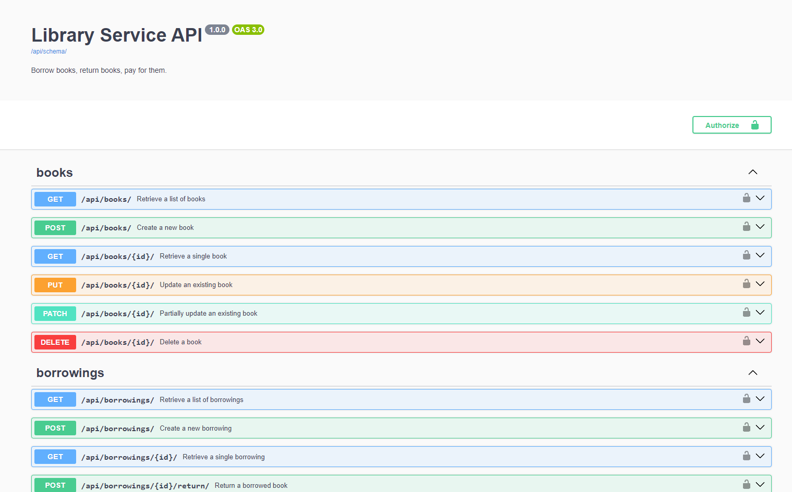

# library-service

This is the Library Management API. This project provides a comprehensive set of endpoints to manage the library ecosystem.

## Features

- JWT token authentication.
- Swagger documentation.
- Throttling with anon, authenticated users.
- Telegram bot with simple functionality (buttons).
- Telegram bot with notifications (borrowing/payment/overdue).
- API Pagination.
- Library API has such apps api/: books, borrowings, payments, users.
- For their detailed endpoints you can check our swagger documentation /api/schema/swagger/.
- Use project endpoints to create borrowings, keep track of overdue, payments, etc.

## Docker installation:

1. **Clone the repository:**

   ```sh
   git clone https://github.com/panicua/library-service.git
   cd library-service
   ```
   
2. Create an `.env` file in the root of the project directory. You can use the `.env.sample` file as a template:

   ```sh
   cp .env.example .env
   ```

3. Create app images and start it (you can comment containers such as telegram bot in docker-compose.yml if you don't need it):
   ```sh
   docker-compose build
   docker-compose up
   ```

### I prefilled db with sample.json, you can use those credentials:

- **admin_user**. email: admin@admin.com, password: admin
- **auth_user**. email: user@user.com, password: useruser

## DEMO:

